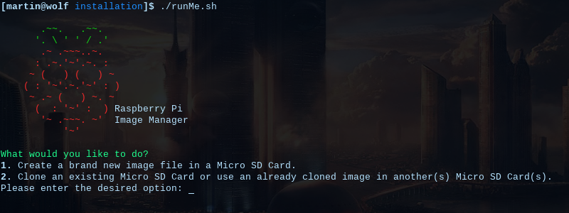
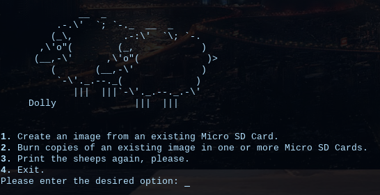
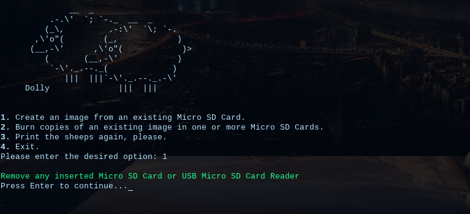
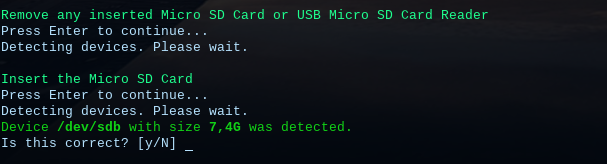
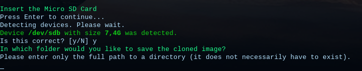
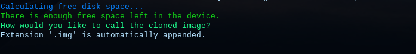
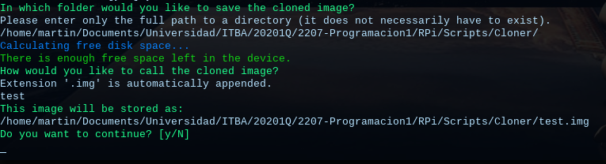
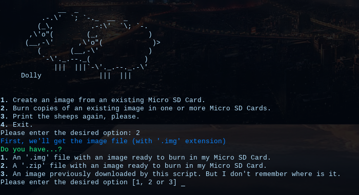
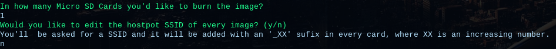
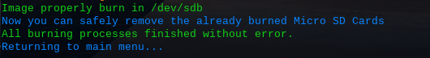

# Script clonador de imágenes

La finalidad de este documento es explicar qué hace (y qué no) este script escrito en Bash.

Una vez descargado el script con sus subscripts, debemos ejecutar los siguientes comandos

```console
]$ chmod +x runMe.sh
]$ ./runMe.sh
```

Notar que el script `runMe.sh` no se ejecuta con permisos de superusuario (root).
Es importante que la carpeta `scripts` con todo su contenido se encuentre en el mismo directorio que el archivo `runMe.sh`, o este fallará.

Al ejecutar el script veremos la siguiente pantalla.


La primer opción no está disponible en esta versión, mas no afecta a nuestros fines.
Por lo tanto, introduciremos `2`, presionaremos Enter e ingresamos nuestra contraseña.




Las opciones que encontramos ahora son las siguientes:
1. _Create an image from an existing Micro SD Card._
Nos permite crear un archivo `.img` a partir del contenido de una Micro SD. En otras palabras, si tenemos una Raspberry Pi funcionando, podemos tomar su Micro SD y convertir todo su contenido en un archivo `.img`, el cual luego podemos volver a grabar en la misma u otra tarjeta.
2. _Burn copies of an existing image in one or more Micro SD Cards._
Teniendo una imagen (no necesariamente creada con la opción 1, mas sí con extensión `.img`), nos permite grabar la misma en otras Micro SD. Podemos realizar esta operación con varias Micro SD _al mismo tiempo_ si disponemos algún método para conectar las mismas a nuestra computadora (dos lectores USB de tarjetas, por ejemplo).

---

## _Create an image from an existing Micro SD Card._

Al seleccionar esta opción, lo primero que nos pedirá será remover la Micro SD de nuestra computadora.



Siguiendo las instrucciones que aparecen en pantalla, removiendo y volviendo a insertar nuestra Micro SD, el script detectará la misma.


Nos pedirá confirmar que la tarjeta detectada sea la correcta.

Luego, se nos pide la _carpeta_ donde deseamos guardar la imagen. TIene que ser una dirección **completa** (es decir, del estilo `/home/usuario/carpeta/` y no `~/carpeta/`) pero no es necesario que exista.
El script se encargará de crear el directorio en tal caso.



Se nos solicita el nombre para nuestra imagen. No hay restricciones en este punto; solamente se debe tener en cuenta que la extensión `.img` se agrega automáticamente.



Por ejemplo, insertando como directorio
`/home/martin/Documents/Universidad/ITBA/20201Q/2207-Programacion1/RPi/Scripts/Cloner/`
Y como nombre de imagen
`test`
El resultado será el siguiente:

Esto significa que en la carpeta `Cloner` se creará el archivo `test.img`, con todo el contenido de nuestra Micro SD.

Cuando confirmamos que queremos realizar la copia de la imagen, el script ejecutará la utilidad `dd` para copiar nuestra Micro SD bajo el nombre de archivo que le dimos. 
Al finalizar, automáticamente PiShrink ^[[Repositorio oficial](https://github.com/Drewsif/PiShrink)] comprimirá nuestra imagen y se volverá al menú principal.

Listo, ya tenemos un archivo `.img` que podemos grabar en otras Micro SD.

---

## _Burn copies of an existing image in one or more Micro SD Cards._

Supongamos que tenemos una imagen creada por este script en formato `.img`. Ya sea que la tengamos dentro de un ZIP ^[Si está dentro de un ZIP, no debe estar dentro de una carpeta del mismo, sino "a simple vista". El script descomprimirá el ZIP y leerá la extensión de los archivos en la carpeta donde se descomprimió el mismo.] o en un directorio, podemos entregar la misma al script para que este la grabe en una o varias Micro SD.



Ingresemos la primer opción y la dirección a la imagen que queremos grabar.
Se nos mostrará en pantalla un pequeño instructivo que podemos simplificar del siguiente modo:

1. Se nos pregunta en cuántas Micro SD queremos grabar la imagen.
2. Se nos pregunta cuántas Micro SD podemos conectar _al mismo tiempo_ a nuestra computadora (utilizando, por ejemplo, dos lectores de tarjetas USB diferentes).
3. Se crearán "tandas" de tarjetas, de acuerdo al número que hayamos ingresado en el paso 2.
4. En cada "tanda", se nos pedirá insertar (una a una) las Micro SD que aún no han sido grabadas.
Notar que, una vez que ya fue detectada una Micro SD en una tanda, esta no debe ser removida hasta que la grabación de todas haya finalizado.
5. Respondemos con `y` o `n` a la pregunta acerca de si queremos editar el nombre del Hotspot en la Micro SD que será grabada. El script siempre agrega un `_XX` (siendo XX un número del 1 en adelante) al final del nombre del hostpot, permitiendo que tengamos varios hostpot con _casi_ el mismo nombre (de modo que no interfieran unos con otros).

6. Insertamos y removemos la(s) Micro SD como se nos solicita en pantalla.
7. Dejamos que el script grabe la imagen en cuantas Micro SD deba hacerlo. Cada vez que termine una tanda, nos pedirá remover todas las Micro SD ya grabadas y repetir el paso anterior con las pendientes.

Al finalizar veremos algo similar a lo siguiente


Por último, se recomienda conectar cada Micro SD a una Raspberry Pi para que estas hagan su primer incio y el sistema de archivos se expanda a través de toda la Micro SD; si no se hace, nos parecerá que hay "muy poco" espacio libre en la tarjeta.


### Ejemplo

Supongamos que tenemos que grabar tres tarjetas y podemos conectar dos Micro SD a la vez en nuestra computadora.

En el paso uno, ingresaremos el número 3 y en el paso dos el número 2. Al ser más tarjetas las que debemos grabar que las que podemos conectar a la vez, se crearán dos tandas.
En la primer tanda, se nos pedirá insertar dos Micro SD, una a la vez.
Tras detectar satisfactoriamente la primera, **no** debemos remover la misma cuando estemos intentando detectar la segunda.
Es decir, siguiendo los pasos en pantalla:
1. Removemos **todas** las Micro SD conectadas a nuestra computadora.
2. Insertamos únicamente la primer tarjeta.
3. Si por algún motivo conectamos más que sólo la tarjeta solicitada en el paso anterior, la removemos. Si no es así, simplemente ignoramos el mensaje de remover las tarjetas.
4. Insertamos la segunda tarjeta.

Cuando la detección termina para la primer tanda, se grabarán estas tarjetas.
Al finalizar el grabado de ambas, se nos pedirá la tarjeta restante. Ahora sí, quitamos las dos ya grabadas e introducimos únicamente la que aún no posee la imagen.
Al finalizar la grabación de esta última, el script volverá al menú principal.

Supongamos que elegimos, en el paso cinco, modificar el SSID del hostpot e ingresamos `MyHostpot` como el SSID deseado.
Cuando conectemos cada tarjeta a una Raspberry Pi y esta entre en dicho modo, las redes que veremos serán:
- `MyHostpot_1`
- `MyHostpot_2`
- `MyHostpot_3`

> **Nota:** Si sólo deseamos grabar una Micro SD y cambiar el nombre del hostpot, el mismo tendrá un `_1` de todos modos. Podemos editar manualmente esto modificando la línea `ssid=` del archivo ubicado en `/etc/hostapd/hostapd.conf`, en la partición _rootfs_ de la Micro SD que grabamos.
